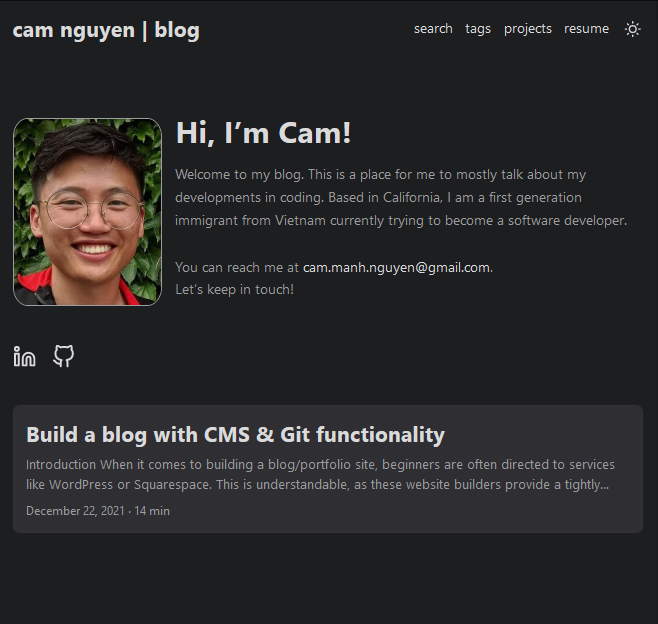

# Cam Nguyen | Blog

### Blog built with Hugo for personal use.

## Features

- Table of Contents generation
- Archive of posts
- Social Icons
- Social media share buttons on posts
- Cover images for each post (with responsive image support)
- Light/Dark theme with a switch button
- SEO friendly
- Search with Fuse.js
- CMS integration with Forestry.io

## Built With 

> For a full breakdown of the build process see: [Build a blog with CMS & Git functionality](https://cambuchi.github.io/blog/posts/build-a-blog/)

- Site generated with [Hugo](https://gohugo.io/)
- Themed with [PaperMod](https://git.io/hugopapermod)
- Content Management System by [Forestry.io](https://forestry.io/)
- Hosted on [GitHub Pages](https://pages.github.com/)
- Customization with vanilla Javascript, HTML, and CSS

## See Live At:

[cam nguyen | blog](https://cambuchi.github.io/blog/)

## Getting Started

I wrote a full instructional guide on how to build a similar blog for your own personal use:

[Build a blog with CMS & Git functionality](https://cambuchi.github.io/blog/posts/build-a-blog/)

## Improvements

Features to be added in the future:
- A better layout with teaser images for the projects section.

## Special Thanks

- [Hugo](https://gohugo.io/)
- [PaperMod](https://git.io/hugopapermod)
- [Forestry.io](https://forestry.io/)

## 🤝 Contributing

Contributions, issues, and feature requests are welcome!

## Show your support

If you're still  here, show your love by hitting the ⭐️ button, I'd really appreciate it.
